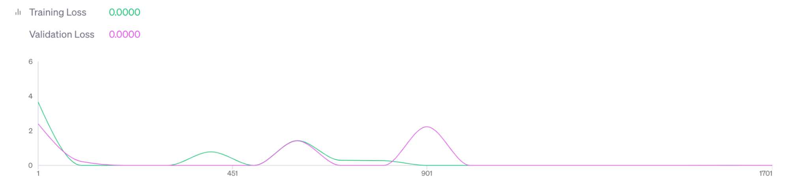

# Software Impact Hackathon 2023: Scientific Software Citation Intent

## Introduction 

We are motivated to investigate the authors’ citation intent when referencing software in scholarly articles. Aligned with the main topic of the hackathon, we identify citation intent classes that convey the notion of impact, for authors and consumers of the software. 

Citation context analysis is believed to be able to reveal more granular reasons for researchers to give and receive citations and hence contributes to the overall understanding of how credit and knowledge flows between researchers and their outcomes. We believe this benefit of understanding not just how software is mentioned in publications, but the reasons why it is mentioned, is critical for the construction of a deeper understanding of the roles played by research software in the academic system and contributing to a fairer scientific reward system in the future. 

Even though a large number of citation context classification systems have been proposed for scientific publications, especially Scite (Nicholson et al., 2021), Very few systems have been proposed for the citations or mentions of research software in scientific publications, with the few exceptions of SoftCite (Du et al., 2021) and SoMeSci (Schindler et al., 2020). However, both of these latter efforts are based and only tested on limited publication samples. Thus, we believe it is vital to construct a system by reusing existing efforts as much as possible, and apply the system to a large-scale software name dataset that only recently emerged, to improve existing research infrastructure for empirical studies on research software.

## Citation Intent Classes

We analyzed a few different schemes of citation contexts/intents for regular research articles and software, to construct our own classes. The list of schemes and their categories are listed below:

- ACL-ARC (Jurgens, 2018):
  - Background
  - Compare/contrast
  - Motivation
  - Extends
  - Future work
- SciCite: Citation intent classification dataset (Cohan et al., 2019)
  - Background Information
  - Method
  - Result Comparison
- SoftCite (Du et al., 2021):
  - Created
  - Used
  - Shared
- SoMeSci (Schindler et al., 2020):
  - Usage
  - Mention
  - Creation
  - Deposition

We further established two principles behind our own scheme: 
1. Citations are shared, deposited as they are based on URIs, hence point to “things on the (open) web;” 
2. We are striving to understand the **impact** of software cited in scholarly articles, so authors of created and cited software should get credit for their work.
   
Based on the above principles and other systems, we proposed the following three categories in our scheme of research software citation intent:
- **Paper <describe_creation_of> Software:** the paper describes or acknowledges the creation of a research software. It is corresponding to the Created category in SoftCite and Creation in SoMeSci.
- **Paper <describes_usage_of> Software:** the paper describes the use of research software in any part of the research procedure, for any purpose. This category is corresponding to the Used category in SoftCite and Usage in SoMeSci.
- **Paper <describes_related_software> Software:** the paper describes the research software for any other reasons beyond the first two categories. It is corresponding to the Mention category in SoMeSci.

Similar to existing efforts, this system only considers “functional” intents, i.e., functional reasons for mentioning the software in publications, instead of other aspects of the intent, such as sentiment and importance (Zhang & Ding, 2013).  Compared to the two existing software citation intent classification systems, we specifically did not include the category of Sharing or Deposition, because we believe that is not strongly relevant to the impact of software being mentioned in publications, despite its importance to open science. 

An important attribute of our scheme is that it is designed to be applied on the sentence level: the evaluation is made based on each sentence where a software entity is mentioned and hence a paper-software pair can have multiple citation intents. Moreover, we also decided that each sentence can only be classified into one category. In the case where multiple categories may apply, we will make a decision based on the degree of impact from the sentence, i.e., creation is greater than usage and usage is greater than other mentions. 

## Datasets
We collectively made the decision to re-use existing datasets as much as possible, rather than spend valuable time creating new datasets and defining new gold standards. We chose to build on the SoftCite, SoMeCi, and CZI datasets that were available to us. The datasets, for the most part, consist of single sentences that contain a software mention (implicit, by means of verbal reference to software and explicit by verbal means in conjunction with an included URI) and their corresponding labels of "used", "created", and "shared". Consolidating these similar yet still slightly different datasets was outside the scope of our group work, in fact, it was subject to another group’s effort during the hackathon. However, given our decision regarding citation intent classes outlined above, we had to make a few adjustments to the existing labels in the provided datasets. From the SoftCite dataset, for example, we were able to transfer labels "used" and "created" directly to our "Usage" and "Creation" classes and mapped most of the "shared" labeled data into "Creation". After careful consideration and much debate, we moved some records that had multiple positive labels or no positive labels at all into our "Mention" category. 

As part of the data curation, we created a pipeline that downloaded all available full text via the PMC API in order to extract the expanded citation context of three sentences surrounding the citation (leading, citing, trailing sentence). 

After all preprocessing, we ended up with [one dataset](https://docs.google.com/spreadsheets/d/1yY1vB_v-1FjVV-VQ8rye84wB8dN5kGh8da4fom8KQwk/edit#gid=1956523166) that we used to train a variety of language models. We split the dataset in typical chunks for training, testing, and evaluation in order to facilitate a reasonable comparison between models. 

The dataset consists of 2,283 software citations, each labeled as "Creation", "Usage", or "Mention", along with the citation context. The context comes in two forms: 
the citing sentence
The leading sentence, the citing sentence, and the trailing sentence
In addition, we created a [dataset of 1,000 unlabeled citation contexts](https://docs.google.com/spreadsheets/d/1yY1vB_v-1FjVV-VQ8rye84wB8dN5kGh8da4fom8KQwk/edit#gid=1940780993) that could be used for negative training examples.

For evaluation, we used a dataset of 411 samples [curated by CZI](https://docs.google.com/spreadsheets/d/1WaM0uqk0I-kFN6MAA5aJwRNGMJClXXUjqddoX0uYsg4/edit#gid=0). This dataset was manually curated by reviewing sentences that contain mentions of software names; the dataset was initially curated before the hackathon using a more granular intent classification which was subsequently mapped to the intent classification described above (creation, used, mention). 

All datasets are also located in the [`data`](data/) folder, with documentation in the respective [README](data/README.md).

## Training Language Models

We explored finetuning several BERT language models for classifying software mentions based on their intent, namely BERT, distilBERT, SciBERT and PubMedBERT. Moreover, we finetuned ChatGPT-3 using three different strategies: zero-shot learning, few-shot learning and finetuning.

The code for finetuning the BERT models is located in [`BERT_finetuning`](BERT_finetuning/).

For zero-shot learning, the prompt used was

```
initial_message = [{"role": "system",
"content": "You are a scientist trying to figure out the citation intent behind software mentioned in sentences coming from research articles. Your four categories are: usage, creation, mention, or none. The definitions of the classes are: \
- usage: software was used in the paper \
- creation: software was created by the authors of the paper \
- mention: software was mentioned in the paper, but not used, nor created \
- none: none of the previous 3 categories apply \
You need to output one category only."}]
```

For few-shot learning, the prompt was

```
num_examples = 5
initial_message = [{"role": "system",
"content": "You are a scientist trying to figure out the citation intent behind software mentioned in sentences coming from research articles. Your four categories are: usage, creation, mention, or none. The definitions of the classes are: \
- usage: software was used in the paper \
- creation: software was created by the authors of the paper \
- mention: software was mentioned in the paper, but not used, nor created \
- none: none of the previous 3 categories apply \
You need to output one category only."}]
for example in examples_used:
initial_message += [{"role": "user", "content" : example}]
initial_message += [{"role": "assistant", "content" : 'usage'}]
for example in examples_created:
initial_message += [{"role": "user", "content" : example}]
initial_message += [{"role": "assistant", "content" : 'creation'}]
for example in examples_mentioned:
initial_message += [{"role": "user", "content" : example}]
initial_message += [{"role": "assistant", "content" : 'mention'}]
for example in examples_none:
initial_message += [{"role": "user", "content" : example}]
initial_message += [{"role": "assistant", "content" : 'none'}]
```

For finetuning Chat-GPT 3.5, we employed early stopping (n_epochs = 2) based on previous run:



## Evaluation 

| model | method | test set | precision | recall | F1 | accuracy |
| --- | --- | --- | --- | --- | --- | --- |
| BERT | finetuned-sentence | test split (n=838) | tbd | tbd | tbd | tbd |
| distilBERT | finetuned-sentence | test split (n=838) | 0.85 | 0.85 | 0.85 | 0.9 |
| distilBERT | finetuned-sentence | CZI validation (n=410) | 0.47 | 0.5 | 0.48 | 0.83 |
| SciBERT | finetuned-sentence | test split (n=843) | 0.76 | 0.96 | 0.85 | 0.81 |
| SciBERT | finetuned-sentence | CZI validation (n=410) | 0.32 | 0.34 | 0.32 | 0.74 |
| SciBERT | finetuned-context | test split (n=843) | 0.79 | 0.94 | 0.86 | 0.81 |
| SciBERT | finetuned-context | CZI validation (n=410) | 0.31 | 0.32 | 0.31 | 0.82 |
| PubmedBERT | finetuned-sentence | test split (n=838) | 0.87 | 0.88 | 0.88 | 0.92 |
| PubmedBERT | finetuned-sentence | CZI validation (n=410) | 0.28 | 0.3 | 0.29 | 0.82 |
| GPT3.5 | zero-shot | test split (n=837) | 0.69 | 0.62 | 0.64 | 0.74 |
| GPT3.5 | zero-shot | CZI validation (n=410) | 0.36 | 0.44 | 0.37 | 0.69 |
| GPT3.5 | few-shot | test split (n=837) | 0.59 | 0.54 | 0.53 | 0.62 |
| GPT3.5 | few-shot | CZI validation (n=410) | 0.34 | 0.39 | 0.29 | 0.51 |
| GPT3.5 | few-shot (context) | test split (n=837) | 0.41 | 0.39 | 0.48 | 0.67 |
| GPT3.5 | few-shot (context) | CZI validation (n=410) | 0.37 | 0.39 | 0.31 | 0.51 |
| GPT3.5 | finetuned | test split (n=837) | 0.87 | 0.86 | 0.86 | 0.91 |
| GPT3.5 | finetuned | CZI validation (n=410) | 0.54 | 0.48 | 0.5 | 0.86 |
| GPT3.5 | finetuned early stopping | test split (n=837) | 0.81 | 0.81 | 0.81 |0.88 |
| GPT3.5 | finetuned early stopping | CZI validation (n=410) | 0.38 | 0.37 | 0.35 | 0.82 |
| GPT3.5 | finetuned with context | test split (n=837) | 0.82 | 0.81 | 0.82 | 0.88 |
| GPT3.5 | finetuned with context | CZI validation (n=410) | 0.42 | 0.42 | 0.41 | 0.8 |

## References 

*Please do not modify or delete any other part of the readme below this line.*

***

## About this project

This repository was developed as part of the [Mapping the Impact of Research Software in Science](https://github.com/chanzuckerberg/software-impact-hackathon-2023) hackathon hosted by the Chan Zuckerberg Initiative (CZI). By participating in this hackathon, owners of this repository acknowledge the following:
1. The code for this project is hosted by the project contributors in a repository created from a template generated by CZI. The purpose of this template is to help ensure that repositories adhere to the hackathon’s project naming conventions and licensing recommendations.  CZI does not claim any ownership or intellectual property on the outputs of the hackathon. This repository allows the contributing teams to maintain ownership of code after the project, and indicates that the code produced is not a CZI product, and CZI does not assume responsibility for assuring the legality, usability, safety, or security of the code produced.
2. This project is published under a MIT license.

## Code of Conduct

Contributions to this project are subject to CZI’s Contributor Covenant [code of conduct](https://github.com/chanzuckerberg/.github/blob/master/CODE_OF_CONDUCT.md). By participating, contributors are expected to uphold this code of conduct. 

## Reporting Security Issues

If you believe you have found a security issue, please responsibly disclose by contacting the repository owner via the ‘security’ tab above.
